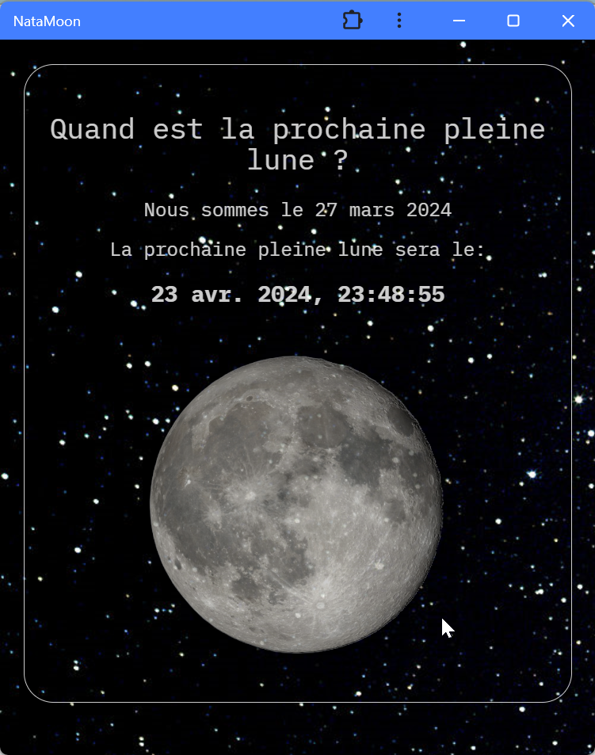
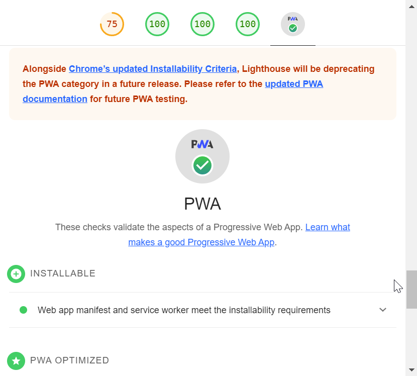

# NataMoon

Simple [Progressive Web Application](https://en.wikipedia.org/wiki/Progressive_web_app) (PWA) giving the next full moon date.

That's it :smile:

## Uses

* Flask
* pyephem

## Screenshot

  

## Install

* go to url
* on Chrome, click on the button in the address bar to open the "Install app" dialog
* on Firefox on Android, click on the 3 dots to open Firefox main menu, then tap **Install**

## Sources

Skeleton PWA from:
* https://github.com/Trigo93/flask_pwa_example

Thanks [Trigo93](https://github.com/Trigo93)!
